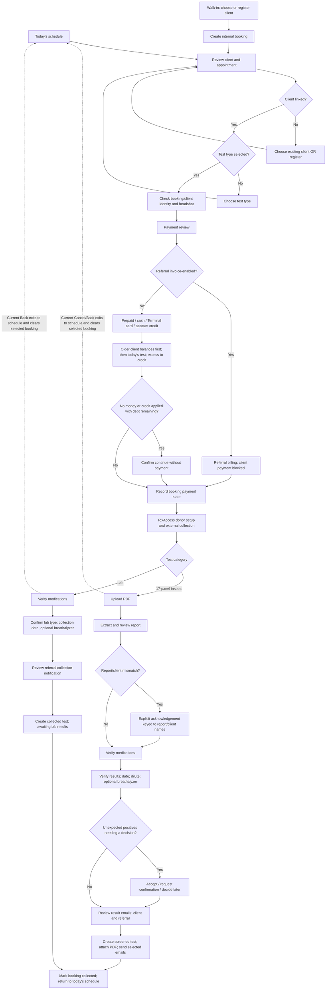
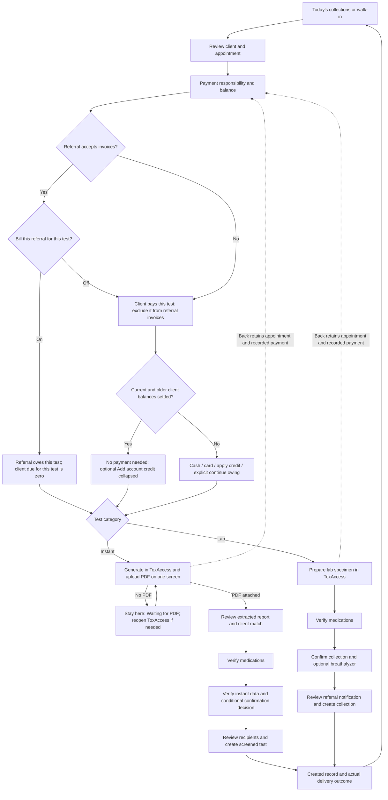

# Guided collection: flow and design review

Review date: October 3, 2026. Source: `origin/main` at `54f5d58`. Branch: `codex/guided-test-collection-review`.

This is a review package. No application code, data model, migration, payment, email, or external integration has been changed. Open [the screen gallery](./review.html) to compare the generated concepts. The implementation proposals are [006: collection interface and navigation](../006-guided-collection-interface.md), [007: payment responsibility per test](../007-per-test-payment-responsibility.md) and [008: staff navigation, summaries and account payments](../008-staff-navigation-and-summary-views.md); none has been implemented.

## Latest design direction

The expanded collection mockups were rejected. This revision restores the earlier simple step layouts, retains the liked client/referral summaries and replaces the main gallery with 19 selected concepts. Earlier drafts remain available as files but are excluded from the gallery.

- Today shows appointments and collection actions; remove the added Follow-up section.
- Keep the client headshot/name/DOB row compact. Only client context and result context repeat between collection steps.
- Prepare contains client context and the generate/upload tasks. No medication content or medication imagery.
- Verify medications once, in its own checkpoint; retain configured expectations and occasional edits.
- Show one small labeled result strip: status, expected substances and detected substances. Preserve exact existing classification; green expected-positive is different from negative, yellow warns or indicates pending review, and red flags unexpected/critical findings. A missing or stale preview never appears negative or ready.
- Use the existing short result-decision choices. Optional test edits are collapsed, while required decisions, warnings and invalid fields remain visible or open automatically.
- Final review contains client/result context, recipients and the report. Remove payment, medication and full test-details recaps.

Required validators, report/client matching, medication snapshots, confirmation choices and server classification remain business checkpoints. The simpler presentation does not remove these safeguards.

## Recommendation

Keep one collection flow with visible phases: **Client → Payment → Prepare → Details → Review**. These are phases, not a claim that every test takes exactly five screens. Report review, medications, and result verification remain distinct checkpoints within the instant path.

For instant tests, put **Generate in ToxAccess** and **Upload the saved PDF** on the same screen. The external ToxAccess button still opens a separate tab. After generating and saving the report, the technician closes that tab and uploads the PDF into the screen they left open. Until a file is attached, the screen says **Waiting for PDF** and cannot continue. Returning focus or closing the external tab must never imply the report was generated: there is no report-generation webhook. Donor readiness is a separate status. Extraction, report/client checks, and result verification still happen afterward.

For prepaid bookings with no older client debt, show **No payment needed** and **$0 remaining**. Put optional prepayment in a collapsed **Add account credit** disclosure. If older client debt exists, explicitly say **Today's test is prepaid; previous client balance remains** and keep that balance visible. Available account credit is not the same as a prepaid appointment: it must be intentionally applied through the existing payment action.

For invoice-enabled referrals, show an actual switch: **Bill this referral — for this test only**. On means the referral owes the test balance; off means the client owes it. The technician chooses eligibility manually. This is a per-test exception, not a change to the referral's profile or recipient list. Persisting that exception is a separate backend change because current payment, invoice, and tracker rules all derive the payer from the client's referral.

## Current flow, traced from code



Registration is a conditional detour, not a sixth mandatory guided step. Its existing sequence is personal information → account information → screening/referral type → recipients → terms, then return to the same booking's review. The guided `registration` query value currently renders the same review screen.

The ToxAccess step checks/provisions the donor and default test. Its readiness status does **not** verify report generation. Current continuation warns and permits a manual path if provisioning cannot be verified.

The normal guided instant route skips the standalone client step once client hydration succeeds. The lab route starts directly at medications. These old workflow components remain implementation dependencies even though staff no longer use them as separate entry points.

## Proposed flow



## Variables and guards that must survive the redesign

| Variable | Current behavior | Required behavior in the proposal |
| --- | --- | --- |
| Scheduled versus walk-in | Walk-ins create an internal booking. Both then use review. | Keep both; preserve cancel/refund and pending-checkout recovery actions. |
| Client linked / missing | Choose an existing client or register; resume review. | Keep registration and terms intact; no create-test action until a client is linked. |
| Booking/client names differ | Explicit identity confirmation; missing headshot prompts capture or confirmed continuation. | Keep visible, keyed to the current client; never hide required acknowledgement in a disclosure. |
| Test type missing or changed | Review can select/reprice the booking; downstream lab details can also edit test type. | Preserve edits. A guided test-type change must reconcile booking price, payment, routing and ToxAccess reference before submission. |
| Referral invoice eligibility | Referral profile decides responsibility globally. | Eligibility enables a per-test payer choice; staff choose eligibility for this collection. |
| Prepaid appointment | Existing payment is counted, but generic Collect Payment UI still appears without a guided payment summary. | Show prepaid success when client debt is zero. Show older client debt separately if it exists. |
| Account credit | Applying credit is explicit; allocation is oldest eligible debt first. | Do not silently apply credit or call available credit a paid appointment. |
| Prior unpaid versus invoiced balances | Invoiced balances are excluded from client allocation. Not-yet-invoiced referral balances currently lack a per-test distinction. | Separate client debt from all referral debt, even before invoice creation. Preserve oldest-first order within client debt. |
| Cash / Terminal card / zero payment | Cash recording; Terminal pending/failed/cancelled states; zero-payment confirmation when owing. | Keep receipts, pending recovery, cancellation, failure and undo; use actions that say what is actually being done. |
| Referral toggle after payment | No toggle exists. | Do not silently reassign settled or invoiced money. Require the existing correction/refund path if a payer change conflicts with payment. |
| ToxAccess ready / working / needs help | Donor setup and default-test status, with manual fallback. | Keep manual fallback. Never equate donor ready, tab closure, or page focus with a generated report. |
| PDF missing / extraction failure | Upload and extraction are separate screens; extraction errors allow retry/replacement. | Missing PDF blocks advance; extraction failure stays recoverable. Keep parse warnings visible; raw diagnostic details may collapse. |
| Report/client matching | Match, spelling warning, unknown name, or mismatch; mismatch needs acknowledgement. | Preserve severity and acknowledgement. A replacement report or changed client invalidates stale confirmation. |
| Supported instant test | 17-panel only; 15-panel is explicitly rejected. | Keep that restriction; do not revive legacy support through the redesign. |
| Medications | Active/discontinued medications and snapshots affect classification. | Keep verification and occasional add/edit/discontinue actions; no silent skipping. |
| Instant result decisions | Unexpected positives can require accept / request confirmation / pending decision; requested substances required. | Preserve all choices, validators and server checks; required controls remain visible. |
| Lab data | Collection date and optional BAC; no screening result yet. | Do not label a collection negative; no instant upload or result-email requirements. |
| Recipients | Instant: client/referral emails, report attachment. Lab collection: referral notification only, no report attachment. | Preserve edits, preview, disabled-client-email settings and recipient composition independently of the payer choice. |
| Creation/email outcome | Actions can persist a test before reporting an email failure. | Show created record plus actual delivery issue; do not invite duplicate creation to retry email. |
| Reload | Instant deliberately restarts at upload; stored PDF only bridges registration. Lab hydration restores identity, not a full draft. | Do not claim autosave or refresh recovery. Extending draft persistence is separate work. |
| Completed booking | Creation marks `sampleCollection.status=collected`, links the test, and uses legacy booking `status=cancelled`. | Preserve this existing backend convention in the UI-only change. Use the collection status for display. |

## Active test types

These are configuration defaults at the review commit, not new pricing decisions.

| Test | Branch | Price | ToxAccess code |
| --- | --- | ---: | --- |
| 17-Panel Instant | Instant | $35 | — |
| 11-Panel Lab | Lab | $40 | B729 |
| 11-Panel Lab (no EtG) | Lab | $40 | B829 |
| 8-Panel Lab | Lab | $40 | B814 |
| 17-Panel SOS Lab | Lab | $45 | B306 |
| EtG Lab | Lab | $40 | No configured code; preserve manual selection |

15-Panel Instant is inactive legacy data. Do not remove legacy records or change downstream lab-result entry flows as part of this review.

## Confirmed findings

| Finding | Evidence | Impact | Effort / change risk | Confidence |
| --- | --- | --- | --- | --- |
| Back at the collection handoff drops the selected booking and returns to schedule. | `DrugTestWizardClient.tsx:76`; instant `components/Navigation.tsx:43`; lab `components/Navigation.tsx:42` | Repeated setup when a report has not been generated. | S–M / medium navigation risk | High |
| ToxAccess preparation has no instant-specific PDF prerequisite; report generation is unobservable. | guided `Workflow.tsx:2503`; instant `Upload.tsx:13`; user's confirmation of no webhook | Easy to advance before generating a report. | M / medium frontend risk | High |
| Extraction detail values and warning titles are oversized. | instant `Extract.tsx:45`, `:161`, `:243`; shared `card.tsx:39` | Inconsistent visual hierarchy; required warnings must remain legible. | S / low visual risk | High |
| Prepaid bookings still enter generic Collect Payment UI. | guided `Workflow.tsx:1743`, `:1834`, `:1980` | Paid clients appear to owe; optional new money competes with continuation. | S–M / low–medium frontend risk | High |
| Referral responsibility is derived per client across multiple systems. | guided `actions.ts:1504`, `:1780`; `referral-invoices.ts:76`; `payer.ts:10`; tracker `actions.ts:209` | A UI-only override would leave client payments blocked or referral invoices wrong. | L / high backend risk | High |

## Safe delivery order

1. **UI and navigation PR:** consistent headers, prepaid presentation, disclosures, report-generation instructions, recoverable handoff. Keep validators, payment allocation, final creation actions and integrations unchanged. Add navigation regressions before merging.
2. **Combined instant report screen:** reuse the existing instant upload form and validator, add the ToxAccess reference/link there, and eliminate the separate guided ToxAccess visit only for instant tests. Keep extraction, medications and final result checks. This removes one screen in the normal instant path without inventing report readiness.
3. **Separate payer PR:** explicit booking/test billing responsibility, invoice and allocation filters, tracker behavior and legacy compatibility. Add the switch only once the backend contract and tests are ready.
4. **Staff navigation and summaries:** keep Payload's native sidebar with role-checked extension links and native Clients / Courts / Employers groups. Preserve required document routes, including tracker/history links to DrugTests; `admin.hidden` also hides routes. Use native Summary/Edit tabs for the liked client/referral layouts and keep basic edits without staff deletion. Standalone account payments require a separate reviewed payment contract; account-level Terminal support cannot reuse a fake booking.

The typography and prepaid presentation can land independently of either routing or billing changes. Keep registration, medication review and final notification review. Combining upload and extraction is a possible later optimization, with higher validation risk than combining preparation with upload.

## Verification performed in this review

Six existing suites passed: **51 tests**, using:

```sh
node node_modules/vitest/vitest.mjs run src/views/DrugTestWizard/workflows/complete-workflow/payment-state.test.ts src/views/DrugTestWizard/workflows/complete-workflow/schedule-utils.test.ts src/views/DrugTestWizard/workflows/paymentSnapshot.test.ts src/views/DrugTestWizard/workflows/instant-test/utils/__tests__/reportClientMatch.test.ts src/lib/referral-invoices/payer.test.ts src/lib/referral-invoices.test.ts
```

The `pnpm exec` attempt could not create pnpm's private package-manager directory under the filesystem sandbox; the already-installed Vitest executable was used. No install was performed. These tests establish a limited current baseline; they do not verify the unimplemented designs. No live collection, Stripe charge, email, ToxAccess action, migration, build, or end-to-end workflow was run.

Audit scope was the guided entry, shared collection steps, validators, payment snapshots, invoice eligibility, payer checks, tracker consumers and related existing tests. This was not a full repository, security, dependency, or external-integration audit.

The revised standalone gallery was checked at 1440px and 390px widths, without page overflow. All 19 selected images decoded successfully. Filters contain 13 instant-path, 12 lab-path, 4 payment-state and 4 staff-view concepts; Previous/Next returns to the same selection. Both overview charts load and were visually inspected in the first review. The selected PNGs were visually inspected during this revision. Browser screenshot capture timed out, so the earlier `qa-gallery-*.png` files document the first gallery, not this revision. These checks apply to the review artifact, not the application redesign.

## Image package

The gallery includes the guided collection screens and payment variants, the standard staff sidebar/Today view, retained client/referral summaries and a simple account-payment concept. Existing registration's five internal screens are retained as-is; the gallery shows the choose/change/register drawer rather than proposing changes to registration. The drawer example changes a linked client; an unlinked booking must not display an assumed client's headshot before selection.

Images are generated visual concepts with fictional data, not captured production screens. Each state is an independent example: the negative extraction example and unexpected-positive verification example deliberately demonstrate different branches. The progress row shows phases; implementation must calculate actual phase completion rather than copy decorative checkmarks from the images. Required errors, parse warnings and confirmation choices must stay expanded. The written behavior above governs implementation.

Images were generated with the built-in Imagegen tool. Original prompts are saved in [prompts.json](./prompts.json); the latest revision prompts are aggregated in [refinement-prompts.json](./refinement-prompts.json). Local PNGs are in [images](./images/), and the selected image list is [simple-screens.json](./simple-screens.json). Earlier drafts are preserved but excluded from the main gallery when a refined version exists. Image-generated sidebar icons/decoration are illustrative; implementation retains native Payload navigation and the existing extension slots.
